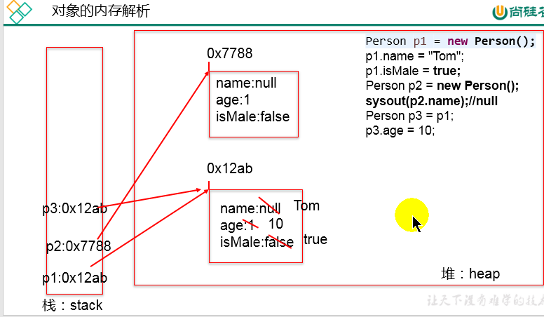

> 从面向对象开始，视频改成尚硅谷教程，并且编辑器改成 idea

#### 面向对象内容的三条主线

1. Java类及类的成员「属性、方法、构造器、代码块、内部类」
2. 面向对象的三大特征「封装性、继承性、多态性、 (抽象类)」
3. 其他关键字 「this，super，static，final，abstract，interface，package，import...」


#### 面向对象「OOP」和面向过程「POP」的对比

1. 面向过程强调功能和行为，以函数为最小单位，考虑的是怎么做；
2. 面向对象则将功能封装在对象内，强调具备了功能的对象，以类/对象为最小单位，考虑的是谁来做；
3. 面向对象更加强调运用人类在日常的思维逻辑中采用的思想方法与原则；


#### 类和实例

1. 类：是对一类食物的描述，是抽象，概念上的定义；

   面向对象程序设计的重点就是对类的设计

   Java中用类class来描述，常见的成员有「属性、行为」

   ```java
   public class Person {
       // 属性
       String name;
       int age;
       boolean isMarried;
       //构造器
       // 一 无参数
       public Person(){};
       // 二 有参数
       public Person(String n, int a, boolean im){
           name=n;
           age=a;
           isMarried=im;
       }
       // 方法
       public void setName(String name){
           this.name = name;
       }
       
       public void setAge(int age){
           this.age = age;
       }
       
       public void setMarried(boolean im){
           this.isMarried = im;
       }
       
       public void displayInfo(){
           String r = (this.isMarried)? "是" : "否";
           System.out.println("姓名: " + this.name);
           System.out.println("年龄: " + this.age);
           System.out.println("婚否: " + r);
       }
   }
   ```

   

2. 对象：是实际存在的该类事物的每个个体，因此也称为「instance」;

   ```java
   // 创建实例
   public class PersonTest{
       public static void main(String[] args){
           // 使用无参数构造器创建
           Person xm = new Person();
           xm.name = "小明";
           xm.age = 28;
           xm.isMarried = true;
           xm.displayInfo();
           // 使用有参数构造器创建
           Person xm = new Person("小明", 29, true);
           xm.displayInfo();
       }
   }
   // 如果新创建的对象没有给定参数，那么默认值为:
   // String -> null
   // int -> 0
   // boolean -> false
   ```

   

#### 对象的创建和使用：内存解析

* 堆[Heap]：存放实例对象，所有实例对象以及数组都要在堆上分配；
* 栈[Stack]：存储局部变量「各种基本数据类型，对象引用。方法执行完毕，自动释放」
* 方法区[Method Area]: 用于存储已被虚拟机加载的类信息、常量、静态变量、即时编译器编译后的代码等数据；




#### 属性与局部变量的对比

1.  在类中声明的位置不同

    **属性**: 直接定义在类的第一层大括号中

    **局部变量**: 声明在方法,方法形参,代码块,构造形参,构造内部e

    关于权限修饰符的不同

    *   属性: 可以声明属性时,指明其权限,使用权限修饰符;
    *   常用的权限修饰符有: private, public, 缺省, protected

    **局部变**量不能使用权限修饰符**[final 除外]**

    **属性**默认初始化值:

    *   整型(byte, short, int, long) => 0
    *   浮点型(float, double) => 0.0
    *   字符型(char) => 0 或者 ‘ ’
    *   布尔型 => false
    *   引用类型 => null

    **局部变量**: 没有默认初始化值, 所以在调用局部变量之前,一定要显示的赋值

    *   形参[方法的参数] 在调用的时候需要先赋值

    在内存中加载的位置不同:

    *   属性: 加载到堆空间[ 非 static ]
    *   局部变量: 加载到栈空间

```java
public user {
    // 属性(成员变量)
    String name;
    int age;
    boolean isMarried;
    
    public void speakLanguage(String language) {// 这里的 language就是形参
        System.out.println("我们通过说" + language + "交流!");
    }
    public void eatFood() {
        String food = "Pizze"; // 局部变量
        System.out.println("People love to eat pizze!");
    }
}
```

2.  相同点:

    定义变量的格式一样: 数据类型 变量名 = 值

    先声明,后使用

    变量都有对应的作用域


#### 方法举例与声明的格式

*   方法: 描述类应该具有的功能

*   方法当中可以直接调用类的属性

*   方法的语法结构: 权限修饰符 返回值类型 方法名(形参列表) {方法体}

*   如果方法没有返回值[void],那么使用 return; 表示结束方法运行

*   类中的方法可以相互调用[ 包括调用自己 - 递归], 但是不可以在方法内部定义另一个方法

    ```java
    // 权限修饰符 public
    // 返回值类型 String
    // 方法名 getName
    // 形参列表 String name
    // 方法体 return name
    public String getName(String name) {
        return name;
    }
    
    public void checkName(String[] names){
        for(int i=0; i<names.length; i++){
            if(names[i] == "毛毛") {
                return; // 直接退出该方法,而不仅仅是退出循环
            }
        }
    }
    
    public void useMethodInside() {
        // 调取其他方法
        String name = getName("maomao");
        checkName(name);
    }
    ```


#### 练习

1.  编写教师和学生类,并通过测试类创建对象进行测试

    *   Student 

        属性: String name, int age, String major, String interests,

        方法: say() 返回个人信息

    *   Teacher

        属性: String name, int age, int teachAge, String course

        方法: say() 输出个人信息 

2.  创建一个Person类,定义如下

    调用 study() 输出 “studying”

    调用 showAge() 显示 age 的值

    调用 addAge() 给对象的 age 值 +2

    创建 2个 对象测试[ person1,  person2 ]

    *   属性 String name, int age, int sex
    *   方法 study():void,  showAge():void,  addAge(int i):int

3.  使用面向对象的思想来设计一个Circle类计算圆面积

    ```java
    // 截取小数位[会转换成String类型]
    public Test{
        public static void main(String[] args){
            
            double d = 0.200;
            DecimalFormat df = new DecimalFormat("0.00");
            System.out.println(df.format(d));
            
        }
    }
    ```

4.  声明一个method方法,实现打印一个10*8的*矩形,并在main方法中调用

    修改上面的method,除了打印一个10*8的矩阵,在计算该矩阵的面积,并返回值,在main中调用

    修改method,提供m,n两个参数,方法打印m*n的矩阵,并计算面积,返回面积值,main中调用

    ***类中调用方法需要给方法加上 static 关键字***

5.  定义类Student, 包含属性: number(int), state(int), score(int)

    创建20个学生对象,学号从1-20,成绩和班级随机数生成.

    提示:

     随机整数 java.util.Random => Random r = new Random => r.nextInt() | r.nextInt(int 范围值)		

    1.  打印出3年纪(state 为 3) 的学生信息;
    2.  使用冒泡排序按学生成绩排序,并遍历所有学生信息;

6.  声明一个日期类型MyDate:

    *   属性: 年year, 月month, 日day
    *   创建2个日期对象,分别赋值: 出生日期; 并且显示信息